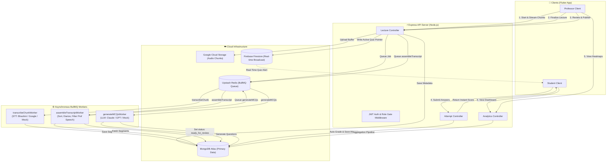
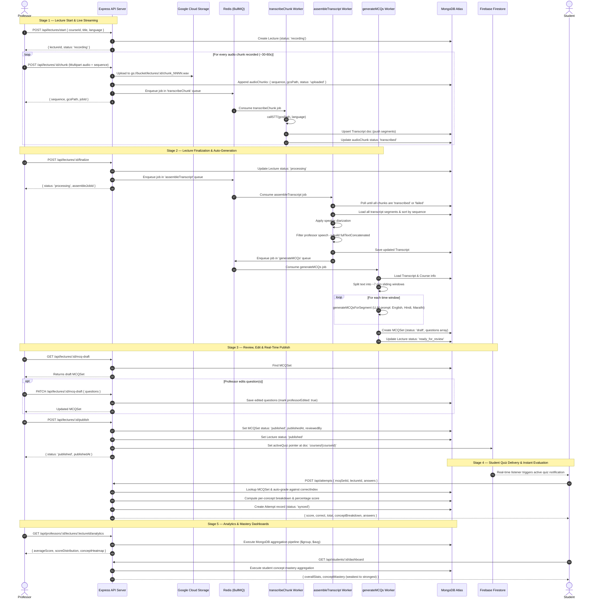
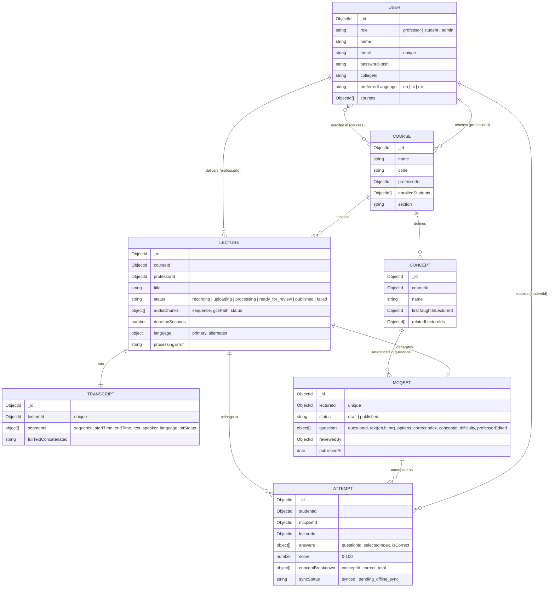

# 🧠 LectureIQ Backend — Architecture & System Design

> **LectureIQ** is a university lecture capture, transcription, automated multilingual MCQ generation, quiz publishing, and real-time student evaluation backend.

---

## 📑 Table of Contents
1. [System Overview](#1-system-overview)
2. [High-Level Architecture](#2-high-level-architecture)
3. [End-to-End Pipeline & Execution Flow](#3-end-to-end-pipeline--execution-flow)
4. [Folder & File Structure](#4-folder--file-structure)
5. [Database Schema & Entity Relationship](#5-database-schema--entity-relationship)
6. [Asynchronous Queues & Worker System (BullMQ + Redis)](#6-asynchronous-queues--worker-system-bullmq--redis)
7. [Pluggable Service Abstractions (STT, LLM, Cloud Storage, Firebase)](#7-pluggable-service-abstractions)
8. [API Reference & Role Gating](#8-api-reference--role-gating)
9. [Error Handling & Fault Tolerance](#9-error-handling--fault-tolerance)
10. [Configuration & Run Guide](#10-configuration--run-guide)

---

## 1. System Overview

LectureIQ automates the entire lifecycle of classroom learning assessments:
- **Continuous Audio Ingestion:** Audio is recorded on the professor's client (e.g., Flutter mobile/desktop app) in small time chunks (~30–60s) and uploaded immediately via multipart stream.
- **Async Speech-to-Text (STT):** Audio chunks are pushed to Google Cloud Storage (GCS) and immediately enqueued for transcription without waiting for the full lecture to conclude.
- **Transcript Assembly & Diarization:** When the lecture is finalized, all transcript segments are reassembled in sequence order, diarized (professor vs. student), and sanitized.
- **LLM-Powered MCQ Generation:** The professor's spoken lecture transcript is partitioned into sliding time windows (~7 minutes) and sent to an LLM (Claude/GPT) to generate high-quality multilingual (English, Hindi, Marathi) MCQs.
- **Professor Review & Instant Publication:** The professor reviews and edits draft questions. Upon publishing, LectureIQ writes an active quiz pointer directly to **Firebase Firestore**, triggering real-time delivery to students.
- **Auto-Evaluation & Class Analytics:** Students submit answers and receive instant auto-graded scores with concept-level performance breakdowns. MongoDB Aggregation Pipelines compute class-wide mastery heatmaps and student weakness dashboards.

---

## 2. High-Level Architecture



---

## 3. End-to-End Pipeline & Execution Flow



---

## 4. Folder & File Structure

```
backend/
├── .env                              # Active environment variables (git-ignored)
├── .env.example                      # Template with all required configuration keys
├── package.json                      # NPM dependencies & scripts (start, dev, seed)
└── src/
    ├── app.js                        # Express application configuration (cors, helmet, routes, error handling)
    ├── server.js                     # Server entry point (connects DB & binds HTTP port)
    │
    ├── config/                       # External infrastructure connectors
    │   ├── db.js                     # Mongoose connection to MongoDB Atlas with auto-reconnect
    │   ├── redis.js                  # Upstash TLS Redis connection helper for BullMQ
    │   ├── firebase.js               # Firebase Admin SDK initialization (Firestore & FCM)
    │   └── gcs.js                    # Google Cloud Storage bucket client & credentials handler
    │
    ├── models/                       # Mongoose Data Models & Schemas
    │   ├── User.js                   # Users with roles (professor, student, admin) & language preference
    │   ├── Course.js                 # Course definitions with professor & enrolled student references
    │   ├── Lecture.js                # Lecture sessions with chunk status tracking & lifecycle states
    │   ├── Transcript.js             # Detailed diarized segments & sanitized concatenated lecture text
    │   ├── Concept.js                # Academic concepts linked to courses and lectures
    │   ├── MCQSet.js                 # Multilingual questions (EN/HI/MR) with options, index, & difficulty
    │   └── Attempt.js                # Student quiz submissions, calculated scores, and concept mastery
    │
    ├── middleware/                   # Express Request Middleware
    │   ├── auth.js                   # JWT verification (`requireAuth`) & role gating (`requireRole`)
    │   ├── upload.js                 # Multer memory storage engine for streaming audio chunks
    │   └── errorHandler.js           # Centralized global error handling middleware & `createError` helper
    │
    ├── routes/                       # Express Route Handlers
    │   ├── auth.js                   # `/api/auth` -> Register and Login endpoints
    │   ├── lectures.js               # `/api/lectures` -> Start, chunk upload, finalize, status, review, publish
    │   ├── attempts.js               # `/api/attempts` -> Submit quiz attempt and auto-evaluate
    │   ├── students.js               # `/api/students` -> Quizzes list (pending/completed) & mastery dashboard
    │   └── professors.js             # `/api/professors` -> Class performance analytics and concept heatmaps
    │
    ├── controllers/                  # Core Business Logic
    │   ├── authController.js         # User registration, bcrypt hashing, JWT issuance
    │   ├── lectureController.js      # Chunk validation, GCS dispatch, queue orchestration, review & Firestore sync
    │   ├── attemptController.js      # Instant O(1) auto-grading & per-concept accuracy tallying
    │   ├── studentController.js      # Student quiz aggregation & concept mastery aggregation pipeline
    │   └── professorController.js    # Class score distribution buckets & concept heatmap aggregation
    │
    ├── services/                     # Pluggable Vendor Integrations
    │   ├── sttService.js             # Speech-to-Text abstraction (Mock, Bhashini ULCA, Google Cloud STT)
    │   └── mcqService.js             # 7-minute time windowing & LLM prompt execution (Mock, Claude, GPT)
    │
    ├── queues/
    │   └── index.js                  # BullMQ queue instances (`transcribeChunk`, `assembleTranscript`, `generateMCQs`)
    │
    ├── workers/                      # Background Job Processors
    │   ├── transcribeChunkWorker.js  # Consumes chunk audio, executes STT, appends transcript segments
    │   ├── assembleTranscriptWorker.js# Waits for chunks, sorts segments, diarizes, filters prof speech, queues MCQ
    │   └── generateMCQsWorker.js     # Splits transcript windows, calls LLM, builds MCQSet, sets ready_for_review
    │
    └── utils/
        ├── gcsUpload.js              # Streaming upload buffer to GCS with fallback mock logger
        └── seed.js                   # Seed script creating test Professor, Student, Course, and Lecture
```

---

## 5. Database Schema & Entity Relationship



---

## 6. Asynchronous Queues & Worker System (BullMQ + Redis)

LectureIQ utilizes **BullMQ** over **Upstash Redis (TLS enabled)** to decouple time-consuming audio processing and LLM calls from HTTP requests.

### Queue Definitions & Configurations

| Queue Name | Primary Trigger | Retry Policy | Exponential Backoff | Concurrency |
| :--- | :--- | :--- | :--- | :--- |
| `transcribeChunk` | Triggered per chunk uploaded at `POST /api/lectures/:id/chunk` | 3 attempts | 2s, 4s, 8s | 5 |
| `assembleTranscript`| Triggered at `POST /api/lectures/:id/finalize` | 3 attempts | 3s, 6s, 12s | 2 |
| `generateMCQs` | Triggered automatically when `assembleTranscript` completes | 2 attempts | 5s, 10s | 2 |

### Worker Responsibilities

1. **`transcribeChunkWorker.js`**:
   - Takes `{ lectureId, sequence, gcsPath }`.
   - Calls `sttService.callSTT(gcsPath, languageConfig)`.
   - Upserts newly returned segments into the `Transcript` model with ordered sequence keys (`sequence * 1000 + i`).
   - Marks the specific chunk on `Lecture.audioChunks[i].status = 'transcribed'`.
   - **Fault Isolation**: If a chunk fails all retries, only that chunk is marked `'failed'`, preserving the rest of the lecture.

2. **`assembleTranscriptWorker.js`**:
   - Takes `{ lectureId, expectedChunks }`.
   - Polls `Lecture.audioChunks` until all chunks reach a terminal state (`transcribed` or `failed`).
   - Sorts all transcript segments chronologically.
   - Filters for `speaker === 'professor'` and `sttStatus === 'success'` to eliminate student chatter/questions from testable lecture notes.
   - Writes `fullTextConcatenated` to MongoDB and enqueues `generateMCQs`.

3. **`generateMCQsWorker.js`**:
   - Takes `{ lectureId }`.
   - Divides the professor's transcript into **7-minute time windows**.
   - Invokes `mcqService.generateMCQsForSegment(windowText, courseContext)`.
   - Structures questions with multilingual text fields (`en`, `hi`, `mr`), 4 options each, `correctIndex`, confidence score, and timestamp references.
   - Saves the final aggregated `MCQSet` in `'draft'` mode and transitions `Lecture.status` to `'ready_for_review'`.

---

## 7. Pluggable Service Abstractions

All vendor-specific external APIs are isolated behind clean, unified service interfaces so they can be switched instantly via environment variables without altering controllers or workers:

### 1. Speech-to-Text (`sttService.js`)
Configured via `STT_PROVIDER=gemini | mock | bhashini | google`
- **Active Live Provider**: **Google Gemini Multimodal Audio** (`gemini-3.7-flash` / `gemini-3.5-flash`).
- **Features**:
  - Live verbatim audio transcription.
  - Native speaker diarization (`professor` vs `student`).
  - Multilingual speech recognition with English, Hindi, and Marathi code-switching support.
  - Automatic model failover if primary endpoint encounters transient load.
  - Timestamped segments matching the `Transcript` schema.

### 2. LLM MCQ Generator (`mcqService.js`)
Configured via `LLM_PROVIDER=gemini | mock | anthropic | openai`
- **Active Live Provider**: **Google Gemini** (`gemini-3.7-flash` / `gemini-3.5-flash`).
- **Features**:
  - 7-minute sliding time windows.
  - Trilingual output generation: English (`en`), Hindi (`hi`), and Marathi (`mr`).
  - Strict JSON schema enforcement with `responseMimeType: "application/json"`.
  - Automatic retry and validation for `questions`, `options`, `correctIndex`, `concept`, `difficulty`, and `confidenceScore`.

### 3. Google Cloud Storage (`utils/gcsUpload.js`)
- Streams memory buffers directly to `gs://<GCS_BUCKET>/lectures/<lectureId>/chunk_<seq>.wav`.
- Falls back to a mock URI stub if credentials (`GOOGLE_APPLICATION_CREDENTIALS`) are omitted.

### 4. Firebase Firestore (`config/firebase.js`)
- Used for ultra-low latency real-time delivery to students.
- Writing to `courses/{courseId}` with `activeQuiz: { mcqSetId, lectureId, publishedAt }` triggers instant snapshot listeners on connected student devices.

---

## 8. API Reference & Role Gating

All protected routes require the header:
```
Authorization: Bearer <JWT_TOKEN>
```

### Authentication (`/api/auth`)
| Method | Endpoint | Auth | Description |
| :--- | :--- | :--- | :--- |
| `POST` | `/api/auth/register` | Public | Register new user (`professor`, `student`, or `admin`). |
| `POST` | `/api/auth/login` | Public | Authenticate user, returns 7-day JWT token and user profile. |

### Lecture Lifecycle (`/api/lectures`)
| Method | Endpoint | Auth / Role | Description |
| :--- | :--- | :--- | :--- |
| `POST` | `/api/lectures/start` | `professor` | Creates a new Lecture session in `recording` status. |
| `POST` | `/api/lectures/:id/chunk` | `professor` | Multipart upload for an audio chunk (`audio` file + `sequence` int). |
| `POST` | `/api/lectures/:id/finalize`| `professor` | Finalizes recording, transitions status to `processing`, queues assembly. |
| `GET` | `/api/lectures/:id/status` | Authenticated | Polling endpoint returning lecture status & chunk breakdown counts. |
| `GET` | `/api/lectures/:id/mcq-draft`| `professor` | Returns the auto-generated draft `MCQSet` for review. |
| `PATCH`| `/api/lectures/:id/mcq-draft`| `professor` | Updates questions array, flags modified items as `professorEdited: true`. |
| `POST` | `/api/lectures/:id/publish` | `professor` | Publishes quiz, sets Lecture to `published`, and broadcasts to Firestore. |

### Student Quiz & Attempts (`/api/attempts` & `/api/students`)
| Method | Endpoint | Auth / Role | Description |
| :--- | :--- | :--- | :--- |
| `POST` | `/api/attempts` | `student` | Submits answers, evaluates score instantly, returns concept breakdown. |
| `GET` | `/api/students/:id/quizzes` | `student` / `admin` | Lists pending and completed quizzes for student's enrolled courses. |
| `GET` | `/api/students/:id/dashboard`| `student` / `admin` | Aggregated student concept mastery summary (weakest to strongest). |

### Professor Analytics (`/api/professors`)
| Method | Endpoint | Auth / Role | Description |
| :--- | :--- | :--- | :--- |
| `GET` | `/api/professors/:id/lectures/:lectureId/analytics` | `professor` / `admin` | Class score distribution (0-20..81-100) & concept difficulty heatmap. |

---

## 9. Error Handling & Fault Tolerance

1. **Fail-Safe Worker Retries**:
   - In `transcribeChunkWorker.js`, if an individual chunk fails after 3 exponential backoff attempts, it is tagged as `status: 'failed'`. The pipeline **does not crash**; `assembleTranscriptWorker` proceeds with the available chunks and logs the gap.
2. **Strict LLM Output Parsing**:
   - If an LLM returns non-JSON or invalid schema, `mcqService.js` automatically retries once with strict format instructions. If it fails again, it records `{ questions: [], failed: true }` for that single window, allowing subsequent windows to succeed.
3. **Fail-Fast Redis Config**:
   - Redis connections configure `connectTimeout: 8000` and `maxRetriesPerRequest: null` (as required by BullMQ) to prevent blocking incoming HTTP requests when queue services encounter transient network latency.
4. **Centralized Error Middleware**:
   - Any runtime error caught by `next(err)` passes to `src/middleware/errorHandler.js`, providing unified HTTP status codes and masking stack traces in production.

---

## 10. Configuration & Run Guide

### 1. Environment Setup (`.env`)
Create a `.env` file in `backend/` based on `.env.example`:

```ini
# Server
PORT=3000
NODE_ENV=development

# MongoDB Atlas
MONGO_URI=mongodb+srv://<user>:<password>@<cluster>.mongodb.net/lectureiq?retryWrites=true&w=majority

# Upstash Redis (TLS)
REDIS_URL=rediss://default:<password>@<host>:6379

# Authentication
JWT_SECRET=your_super_secret_jwt_key

# Google Cloud Storage (Audio Chunks)
GCS_BUCKET=lectureiq-audio-chunks
GOOGLE_APPLICATION_CREDENTIALS=./service-account.json

# Firebase Admin SDK (Firestore & FCM)
FIREBASE_SERVICE_ACCOUNT_PATH=./firebase-service-account.json

# Service Providers (mock | bhashini | google)
STT_PROVIDER=mock

# LLM Provider (mock | anthropic | openai)
LLM_PROVIDER=mock
ANTHROPIC_API_KEY=
OPENAI_API_KEY=
```

### 2. Database Seeding
To populate initial test users (Professor, Student) and sample Courses:
```powershell
cd backend
npm run seed
```

### 3. Running the System

#### Option A — Single Terminal (API Only for Development)
```powershell
cd backend
npm run dev
```

#### Option B — Full Multi-Worker Execution (Production / Full Async Testing)
Run each in a separate terminal:

```powershell
# Terminal 1: API Server
cd backend
node src/server.js

# Terminal 2: STT Chunk Transcriber Worker
cd backend
node src/workers/transcribeChunkWorker.js

# Terminal 3: Transcript Assembly Worker
cd backend
node src/workers/assembleTranscriptWorker.js

# Terminal 4: MCQ Generation Worker
cd backend
node src/workers/generateMCQsWorker.js
```
